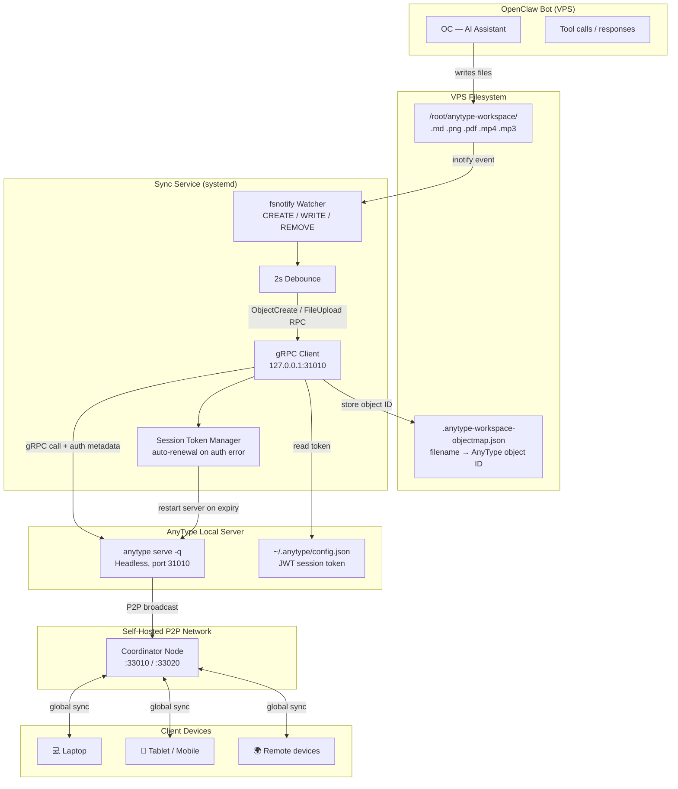
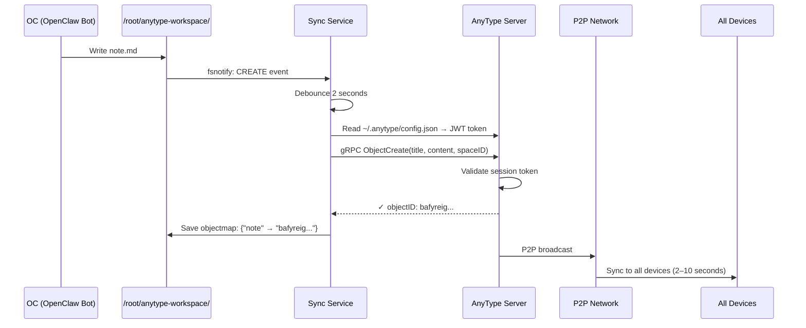
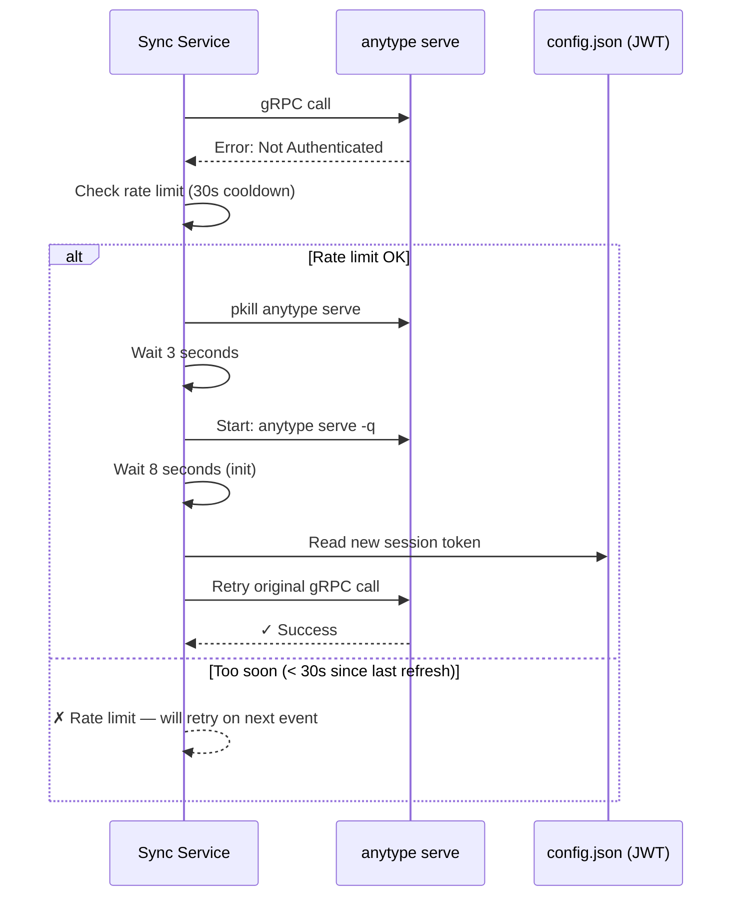

# 🦞 OC — OpenClaw Workspace

This is the workspace for **OC**, Rob's personal AI assistant running on [OpenClaw](https://openclaw.ai), hosted on `simplemap.safecast.org`.

---

## AnyType Sync Integration

The core feature of this workspace is a live bridge between OpenClaw and [AnyType](https://anytype.io) — a self-hosted, privacy-first knowledge graph. When OC writes a file to a watched directory on the VPS, it automatically appears in AnyType across all devices within seconds.

### How It Works — Big Picture



---

### End-to-End Sequence: Creating a Note



---

### File Types Supported

| Type | Extensions | AnyType Object | RPC Method |
|------|-----------|---------------|------------|
| Markdown | `.md` | Note | `ObjectCreate` |
| Images | `.jpg` `.png` `.gif` `.webp` `.svg` | Image | `FileUpload` |
| Documents | `.pdf` | PDF | `FileUpload` |
| Video | `.mp4` `.mov` `.avi` `.mkv` `.webm` | Video | `FileUpload` |
| Audio | `.mp3` `.wav` `.ogg` `.m4a` `.flac` | Audio | `FileUpload` |

---

### Token Auto-Renewal

AnyType session tokens expire when the server restarts. The sync service detects auth failures and self-heals:



---

## Setup Guide

### Prerequisites

- Ubuntu VPS with root access (tested on 24.04)
- Self-hosted [AnyType network](https://github.com/anyproto/any-sync) with:
  - Network ID and `client-config.yml`
  - Space ID and an invite link (`cid` + `key`)
- Go 1.21+ (for building the sync binary)

---

### Step 1 — Install AnyType CLI

```bash
wget https://github.com/anyproto/anytype-cli/releases/latest/download/anytype-linux-amd64
chmod +x anytype-linux-amd64
mkdir -p /root/.local/bin
mv anytype-linux-amd64 /root/.local/bin/anytype
/root/.local/bin/anytype version
```

---

### Step 2 — Create a Bot Account

```bash
/root/.local/bin/anytype auth create my-sync-bot \
  --network-config /var/lib/anytype/data/client-config.yml
```

Save the output — you'll need the **Account Key** and **Account ID**.

---

### Step 3 — Start AnyType Server and Join Space

```bash
# Start headless AnyType server
nohup /root/.local/bin/anytype serve -q > /tmp/anytype-serve.log 2>&1 &
sleep 5

# Verify gRPC is listening
ss -tlnp | grep 31010

# Join your space
/root/.local/bin/anytype space join \
  'anytype://invite/?cid=YOUR_CID&key=YOUR_KEY' \
  --network YOUR_NETWORK_ID

# Verify
/root/.local/bin/anytype space list
```

---

### Step 4 — Build and Deploy the Sync Service

```bash
# Build (locally or on VPS)
cd code/anytype-workspace-sync
go build -o anytype-workspace-sync-bin

# Update spaceID in main.go before building:
# const spaceID = "YOUR_SPACE_ID_HERE"

# Deploy to VPS
scp anytype-workspace-sync-bin root@YOUR_VPS:/root/
ssh root@YOUR_VPS "mkdir -p /root/anytype-workspace"
```

---

### Step 5 — Create Systemd Service

```bash
cat > /etc/systemd/system/anytype-workspace-sync.service <<'EOF'
[Unit]
Description=AnyType Workspace Sync Service
After=network.target

[Service]
Type=simple
User=root
WorkingDirectory=/root
ExecStart=/root/anytype-workspace-sync-bin
Restart=always
RestartSec=10
StandardOutput=journal
StandardError=journal

[Install]
WantedBy=multi-user.target
EOF

systemctl daemon-reload
systemctl enable --now anytype-workspace-sync.service
```

Check it's running:
```bash
systemctl status anytype-workspace-sync
journalctl -u anytype-workspace-sync -f
```

---

### Step 6 — Test It

```bash
# Create a test note
echo "# Hello from OC" > /root/anytype-workspace/hello.md

# Watch the logs
journalctl -u anytype-workspace-sync -n 20
# → [2026-03-01T12:00:00Z] ✓ hello synced to AnyType

# Delete it
rm /root/anytype-workspace/hello.md
# → [2026-03-01T12:00:05Z] ✓ hello deleted from AnyType
```

Open your AnyType app — the note should appear (and disappear) within a few seconds.

---

## Key File Locations

| Path | Purpose |
|------|---------|
| `/root/anytype-workspace/` | Watched directory — drop files here |
| `/root/anytype-workspace-sync-bin` | Sync service binary |
| `/root/.anytype/config.json` | AnyType credentials + live JWT session token |
| `/root/.anytype-workspace-objectmap.json` | Maps filenames → AnyType object IDs |
| `/tmp/anytype-serve.log` | AnyType server stdout |
| `/var/lib/anytype/data/client-config.yml` | P2P network configuration |

---

## Common Operations

```bash
# View sync logs (live)
journalctl -u anytype-workspace-sync -f

# Restart sync service
systemctl restart anytype-workspace-sync

# Check auth
/root/.local/bin/anytype auth status

# List spaces
/root/.local/bin/anytype space list

# Full restart (if stuck)
systemctl stop anytype-workspace-sync
pkill -f 'anytype serve'
sleep 3
nohup /root/.local/bin/anytype serve -q > /tmp/anytype-serve.log 2>&1 &
sleep 8
systemctl start anytype-workspace-sync
```

---

## Troubleshooting

| Symptom | Cause | Fix |
|---------|-------|-----|
| `not authenticated` | Session token expired | Restart both services (see above) |
| Files not syncing | Sync service stopped | `systemctl restart anytype-workspace-sync` |
| Space not found | Wrong `spaceID` in binary | Update `main.go`, rebuild, redeploy |
| `connection refused` on port 31010 | AnyType server not running | `nohup anytype serve -q &` |
| Object map out of sync | File deleted outside service | Manually edit `.anytype-workspace-objectmap.json` |

---

## Workspace Files

| File | Purpose |
|------|---------|
| `SOUL.md` | OC's personality, values, and vibe |
| `IDENTITY.md` | Name, emoji, avatar |
| `USER.md` | About Rob — context that helps OC be more useful |
| `AGENTS.md` | How OC operates — memory, sessions, tools, heartbeats |
| `TOOLS.md` | Local setup notes (cameras, SSH, TTS preferences, etc.) |
| `HEARTBEAT.md` | Periodic check-in tasks (email, calendar, reminders) |
| `memory/` | Daily notes and long-term memory files |
| `skills/anytype-sync/` | OpenClaw skill for querying AnyType via MongoDB |
| `code/anytype-workspace-sync/` | Source code for the Go sync service |

---

## Accessing OC

### Web chat (SSH tunnel)

The OpenClaw dashboard runs on `http://127.0.0.1:18789` — loopback only. To access it:

```bash
ssh -L 18789:localhost:18789 root@simplemap.safecast.org -N
```

Then open: **[http://localhost:18789](http://localhost:18789)**

Add `-f` to run the tunnel in the background:
```bash
ssh -fNL 18789:localhost:18789 root@simplemap.safecast.org
```

### Messaging
- **Telegram / WhatsApp / Signal** — if configured in `openclaw.json`

---

## Stack

| Component | Details |
|-----------|---------|
| Runtime | [OpenClaw](https://github.com/openclaw/openclaw) |
| AI Model | Anthropic Claude (Sonnet) |
| Sync Service | Go binary (`anytype-workspace-sync`) |
| AnyType Server | `anytype serve -q` (headless, gRPC on :31010) |
| P2P Network | Self-hosted `any-sync-bundle` |
| Host | `simplemap.safecast.org` |
| Owner | [Rob Oudendijk](https://yr-design.biz) |
