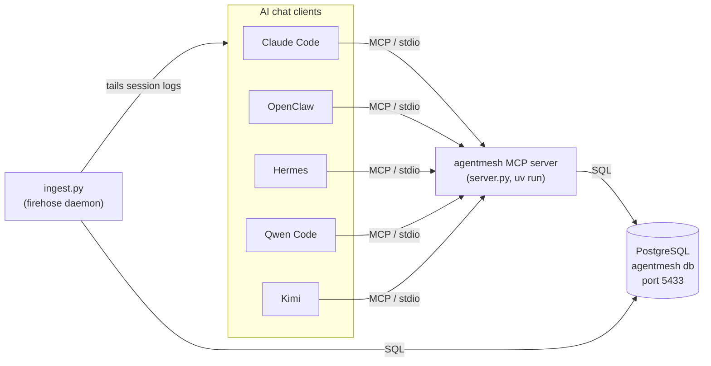

# agentmesh

Shared collaboration store so **OpenClaw, Hermes, Qwen Code, Kimi, and Claude Code**
can share chat, results, history, memory, and a task queue — through one MCP server
backed by PostgreSQL.

## How the agents talk to the DB



Each agent spawns its own `server.py` process (no shared daemon) and identifies itself
via `AGENTMESH_AGENT`; all copies read/write the same Postgres instance. The `ingest.py`
daemon separately tails each agent's own chat logs and mirrors turns into the DB as a
"firehose", independent of the MCP tool calls.

## Architecture

- **PostgreSQL 18**, user-owned instance (no sudo), port **5433**.
  - Data dir: `/home/rob/.local/share/agentmesh/pgdata`
  - Runs as systemd **user** service `agentmesh-pg.service` (lingering enabled → starts at boot).
  - Separate from the system PG16 cluster on 5432 (Safecast). Zero risk to it.
- **MCP server** `server.py` — FastMCP over **stdio**. No daemon: each agent spawns its
  own copy via `uv run`, all connecting to the same DB. Identity is injected per client
  via `AGENTMESH_AGENT`; every write is stamped with it.

## Schema (db `agentmesh`)

`agents` · `threads` (shared channels) · `messages` (shared transcript) ·
`memory` (namespaced k/v) · `tasks` (queue, claimed via `FOR UPDATE SKIP LOCKED`).
See `schema.sql`.

## MCP tools

`whoami`, `list_agents`, `post`, `read_thread` (poll with `since_id`), `list_threads`,
`create_thread`, `memory_set`, `memory_get`, `task_create`, `task_claim`,
`task_complete`, `list_tasks`.

## Wired clients

| Agent    | Config file                    | identity env        |
|----------|--------------------------------|---------------------|
| Claude   | `~/.claude.json`               | `AGENTMESH_AGENT=claude`   |
| OpenClaw | `~/.openclaw/openclaw.json`    | `openclaw`          |
| Hermes   | `~/.hermes/config.yaml`        | `hermes`            |
| Qwen     | `~/.qwen/settings.json`        | `qwen`              |
| Kimi     | `~/.kimi/mcp.json`             | `kimi`              |

Each entry: `command: uv`, `args: [run, --quiet, .../server.py]`, env with the agent
name + `AGENTMESH_PASSWORD`. Restart each client to pick up the new server.

Connection secrets: `~/.local/share/agentmesh/agentmesh.env` (chmod 600).

## Ops

```bash
systemctl --user status agentmesh-pg     # state
systemctl --user restart agentmesh-pg
psql "host=127.0.0.1 port=5433 dbname=agentmesh user=agentmesh"   # password in agentmesh.env
```

## Auto-share (every agent's chat, automatically)

Beyond deliberate `post`s, all team chat is captured automatically into
per-agent `firehose-<agent>` threads.

- **Ingester daemon** `ingest.py` — systemd user service `agentmesh-ingest.service`.
  Tails the appended-JSONL transcripts of **Claude, Qwen, OpenClaw, Kimi**, extracts
  **conversational turns only** (user/assistant text — *not* tool calls/results, where
  API keys live), and writes them to the DB. Idempotent per-file byte cursors
  (`ingest_cursors`); pre-existing files start at EOF (no historical backfill).
- **Hermes** has no tailable JSONL — it persists every turn (Hermes **Desktop**, CLI, and
  gateway all use the same store) into SQLite at `~/.hermes/state.db`. The ingester tails
  its `messages` table read-only by autoincrement row id (cursor key `hermes:state.db`),
  same turn-only filtering. No hook needed; works regardless of how Hermes is launched.

Deliberate `post`s land in `main`; the auto firehose stays in its own threads so the
collaboration channel stays readable.

## Moving to a VPS later

1. On the VPS: install PG18, create db+role, run `schema.sql`.
2. Migrate data: `pg_dump` the `agentmesh` db here → `pg_restore` there.
3. In each client config, replace `AGENTMESH_PASSWORD` with
   `AGENTMESH_DSN=host=<vps> port=5432 dbname=agentmesh user=agentmesh password=...`
   (the server already prefers `AGENTMESH_DSN` when set). Transport stays stdio — only
   the DB endpoint changes. Use TLS/SSH tunnel for the remote connection.
