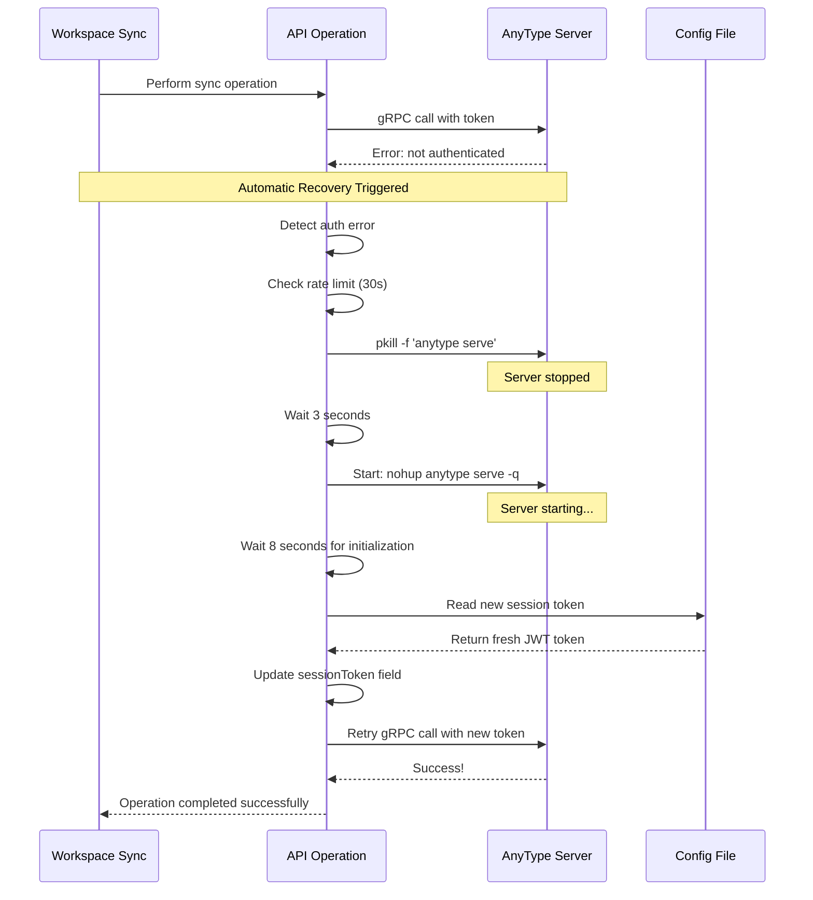
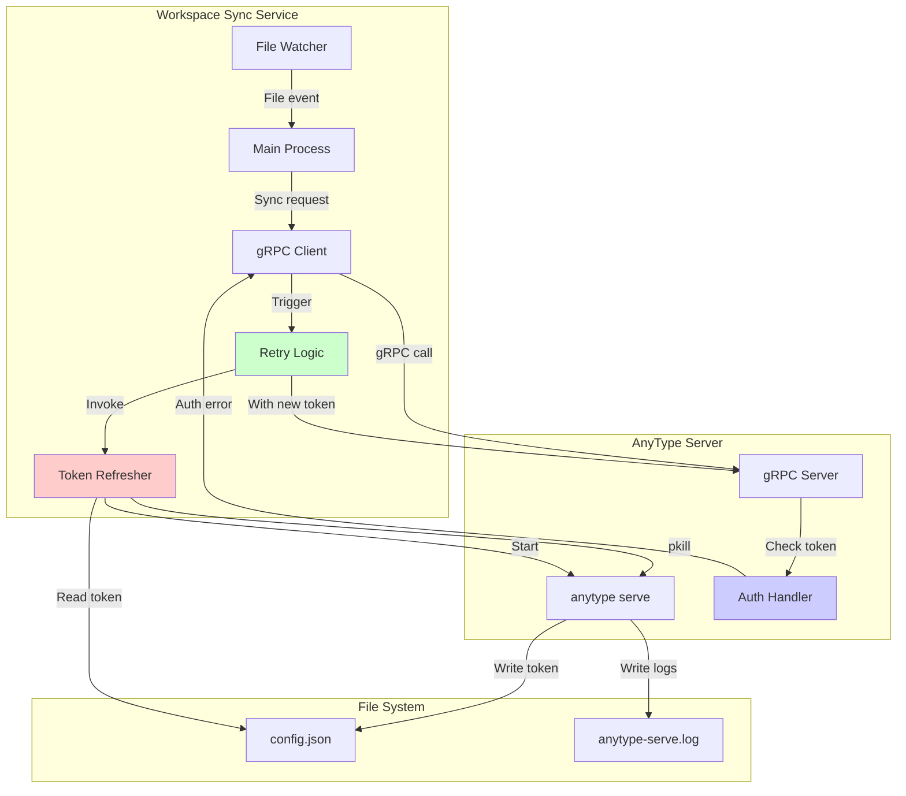

# Automatic Token Renewal - Technical Documentation

## Overview

The AnyType Workspace Sync service now includes intelligent automatic token renewal to handle session token expiry without manual intervention. This feature provides self-healing capabilities that keep the service running reliably even when AnyType session tokens expire.

## Problem Statement

AnyType uses JWT session tokens for authentication. These tokens:
- Are generated when `anytype serve` starts
- Are stored in `~/.anytype/config.json`
- Expire after a certain period
- Require the AnyType server to be restarted to refresh

**Before v1.1.0**, when a token expired:
1. All sync operations would fail with "not authenticated" errors
2. Manual intervention required:
   - Kill `anytype serve` process
   - Restart `anytype serve`
   - Restart `anytype-workspace-sync` service
3. Downtime during the manual recovery process

## Solution: Automatic Token Renewal

The service now automatically detects authentication failures and performs a self-healing recovery:



## Implementation Details

### 1. Authentication Error Detection

```go
func isAuthError(err error) bool {
    if err == nil {
        return false
    }
    errMsg := strings.ToLower(err.Error())
    return strings.Contains(errMsg, "not authenticated") ||
        strings.Contains(errMsg, "authentication failed") ||
        strings.Contains(errMsg, "invalid token") ||
        strings.Contains(errMsg, "session") ||
        strings.Contains(errMsg, "signature is invalid")
}
```

The system checks error messages for authentication-related keywords:
- `"not authenticated"`
- `"authentication failed"`
- `"invalid token"`
- `"session"`
- `"signature is invalid"`

### 2. Token Refresh Process

```go
func (c *AnyTypeClient) refreshToken(ctx context.Context) error {
    // 1. Rate limiting check
    if time.Since(c.lastRefresh) < 30*time.Second {
        return fmt.Errorf("token refresh rate limit")
    }

    // 2. Kill existing anytype server
    exec.Command("pkill", "-f", "anytype serve").Run()

    // 3. Wait for clean shutdown
    time.Sleep(3 * time.Second)

    // 4. Start new anytype server
    startCmd := exec.Command("nohup", c.anytypeBinary, "serve", "-q")
    startCmd.Stdout = logFile
    startCmd.Stderr = logFile
    startCmd.Start()

    // 5. Wait for server initialization
    time.Sleep(8 * time.Second)

    // 6. Reload token from config
    newToken, err := readSessionToken()

    // 7. Update client's token
    c.sessionToken = newToken
    c.lastRefresh = time.Now()

    return nil
}
```

**Key Steps**:
1. **Rate Limiting**: Prevents refresh loops (max 1 refresh per 30 seconds)
2. **Clean Shutdown**: Kills existing `anytype serve` process
3. **Wait Period**: 3-second delay ensures process fully stops
4. **Restart Server**: Starts new `anytype serve` in background
5. **Initialization Wait**: 8-second delay for server to start and generate new token
6. **Token Reload**: Reads fresh token from `~/.anytype/config.json`
7. **Update State**: Stores new token and timestamp

### 3. Retry Logic

```go
func (c *AnyTypeClient) withRetry(ctx context.Context, operation func() error) error {
    // Try operation first
    err := operation()

    // If success or non-auth error, return immediately
    if err == nil || !isAuthError(err) {
        return err
    }

    // Auth error detected - refresh token
    fmt.Printf("⚠ Authentication error detected: %v\n", err)

    if refreshErr := c.refreshToken(ctx); refreshErr != nil {
        return fmt.Errorf("auth error (token refresh failed): %w", err)
    }

    // Retry operation with new token
    fmt.Printf("🔁 Retrying operation with refreshed token...\n")
    return operation()
}
```

All authenticated operations are wrapped with `withRetry()`:
- `SyncMarkdownWithID()` - Create/update objects
- `DeleteMarkdown()` - Delete objects
- `OpenSpace()` - Open workspace

### 4. Thread Safety

```go
type AnyTypeClient struct {
    conn          *grpc.ClientConn
    addr          string
    sessionToken  string
    refreshMutex  sync.Mutex  // Prevents concurrent refreshes
    lastRefresh   time.Time   // Tracks last refresh time
    anytypeBinary string
}
```

**Concurrency Control**:
- `refreshMutex` ensures only one token refresh happens at a time
- Multiple goroutines can trigger refresh, but only one proceeds
- Others wait and reuse the refreshed token

## Configuration

### Default Settings

| Parameter | Value | Purpose |
|-----------|-------|---------|
| **AnyType Binary** | `/root/.local/bin/anytype` | Path to anytype CLI |
| **Server Shutdown Wait** | 3 seconds | Time for clean process termination |
| **Server Startup Wait** | 8 seconds | Time for server initialization + token generation |
| **Rate Limit** | 30 seconds | Minimum time between refresh attempts |
| **Log File** | `/tmp/anytype-serve.log` | Server output location |

### Customization

To change the anytype binary path, edit [client.go](client.go):

```go
client := &AnyTypeClient{
    addr:          addr,
    anytypeBinary: "/custom/path/to/anytype",  // ← Change here
}
```

## Monitoring

### Log Messages

**Successful Token Renewal**:
```
[2026-03-01T12:34:56Z] ⚠ Authentication error detected: not authenticated - check network membership
[2026-03-01T12:34:56Z] 🔄 Attempting to refresh session token...
[2026-03-01T12:34:56Z]   → Stopping anytype server...
[2026-03-01T12:34:59Z]   → Starting anytype server...
[2026-03-01T12:34:59Z]   → Waiting for server to initialize...
[2026-03-01T12:35:07Z]   → Reading new session token...
[2026-03-01T12:35:07Z] ✓ Session token refreshed successfully
[2026-03-01T12:35:07Z] 🔁 Retrying operation with refreshed token...
[2026-03-01T12:35:07Z] ✓ test-note synced to AnyType
```

**Rate Limited**:
```
[2026-03-01T12:34:56Z] ⚠ Authentication error detected: not authenticated
[2026-03-01T12:34:56Z] 🔄 Attempting to refresh session token...
[2026-03-01T12:34:56Z] Token refresh attempted too soon, skipping
```

**Failed Refresh**:
```
[2026-03-01T12:34:56Z] ⚠ Authentication error detected: not authenticated
[2026-03-01T12:34:56Z] 🔄 Attempting to refresh session token...
[2026-03-01T12:34:56Z]   → Stopping anytype server...
[2026-03-01T12:34:59Z]   → Starting anytype server...
[2026-03-01T12:34:59Z] ✗ Token refresh failed: failed to start anytype server: exec error
```

### Monitoring Commands

```bash
# Watch for token renewal events
journalctl -u anytype-workspace-sync -f | grep -E "refresh|Authentication"

# Check AnyType server restarts
journalctl -u anytype-workspace-sync --since "1 hour ago" | grep "Starting anytype server"

# View last token refresh
journalctl -u anytype-workspace-sync | grep "Session token refreshed" | tail -1

# Check for rate limiting
journalctl -u anytype-workspace-sync | grep "attempted too soon"
```

## Performance Impact

### Overhead

| Aspect | Impact |
|--------|--------|
| **Normal Operation** | Zero overhead (only triggered on auth errors) |
| **During Refresh** | ~11 seconds total (3s shutdown + 8s startup) |
| **Failed Operations** | 1 retry attempt per operation |
| **Memory** | +~10 KB (mutex + timestamps) |

### Recovery Time

```
Token Expires → Error Detected → Refresh Triggered → Server Restart → Token Reload → Retry → Success
     0s              +0.1s              +0.2s              +11s             +11.5s      +12s      ✓
```

**Total Recovery Time**: ~12 seconds from first auth error to successful retry

### Efficiency

- **No Downtime**: Service continues running during refresh
- **No Manual Intervention**: Fully automatic
- **Rate Limited**: Prevents refresh storms
- **Thread Safe**: Multiple operations can proceed safely

## Testing

### Simulate Token Expiry

```bash
# Method 1: Kill anytype server (forces token to become invalid)
pkill -f 'anytype serve'
sleep 5

# Create a file to trigger sync
echo "# Test Note" > /root/anytype-workspace/test.md

# Watch logs for automatic renewal
journalctl -u anytype-workspace-sync -f
```

Expected behavior:
1. Sync operation fails with auth error
2. Automatic refresh triggered
3. Server restarted
4. New token loaded
5. Operation retries and succeeds

### Test Rate Limiting

```bash
# Trigger multiple rapid auth errors
for i in {1..5}; do
    pkill -f 'anytype serve'
    echo "# Test $i" > /root/anytype-workspace/test-$i.md
    sleep 2
done
```

Expected behavior:
- First error triggers refresh
- Subsequent errors within 30s show "attempted too soon"
- All operations eventually succeed after initial refresh

## Troubleshooting

### Token Refresh Not Working

**Check**:
1. AnyType binary path is correct:
   ```bash
   ls -l /root/.local/bin/anytype
   ```

2. Service has permission to kill/start processes:
   ```bash
   systemctl show anytype-workspace-sync | grep User
   # Should show: User=root
   ```

3. Config file is readable:
   ```bash
   cat ~/.anytype/config.json | jq .sessionToken
   ```

### Refresh Happening Too Often

If you see frequent refreshes, check:

```bash
# Count refreshes in last hour
journalctl -u anytype-workspace-sync --since "1 hour ago" | grep -c "Session token refreshed"

# If > 2, investigate root cause
journalctl -u anytype-workspace-sync -p err --since "1 hour ago"
```

**Possible causes**:
- Network issues causing intermittent failures
- AnyType server crashing frequently
- Corrupted config file

### Manual Override

If automatic refresh fails, manual recovery:

```bash
# Stop everything
systemctl stop anytype-workspace-sync
pkill -f 'anytype serve'

# Wait
sleep 5

# Start anytype server
nohup /root/.local/bin/anytype serve -q > /tmp/anytype-serve.log 2>&1 &

# Wait for startup
sleep 10

# Restart sync service
systemctl start anytype-workspace-sync

# Verify
journalctl -u anytype-workspace-sync -n 20
```

## Security Considerations

### Process Control

The service requires permission to:
- Kill `anytype serve` processes
- Start new `anytype serve` processes
- Read `~/.anytype/config.json`

**Recommendation**: Run as `root` or dedicated user with appropriate permissions.

### Token Storage

Session tokens are:
- Stored in `~/.anytype/config.json`
- Read-only to owner (mode 0600 recommended)
- Refreshed automatically, never logged

**Security Best Practices**:
```bash
# Secure config file
chmod 600 ~/.anytype/config.json

# Secure object map
chmod 600 ~/.anytype-workspace-objectmap.json

# Secure log file (contains no sensitive data)
chmod 644 /tmp/anytype-serve.log
```

### Rate Limiting Security

The 30-second rate limit prevents:
- Accidental DoS from refresh loops
- Rapid server restarts causing instability
- Log spam from repeated failures

## Architecture Integration

### System Flow

```
File Change → Sync Operation → Auth Error?
                                    ↓ YES
                            Refresh Token
                                    ↓
                            Retry Operation
                                    ↓
                                 Success
```

### Component Interaction



## Future Enhancements

Potential improvements for v1.2.0+:

1. **Adaptive Timing**
   - Monitor average server startup time
   - Adjust wait periods dynamically

2. **Health Monitoring**
   - Periodic token validation
   - Proactive refresh before expiry

3. **Metrics**
   - Count refresh attempts
   - Track success/failure rates
   - Export to Prometheus

4. **Configurable Timeouts**
   - Make wait times configurable
   - Environment variable support

5. **Multiple Refresh Strategies**
   - Option to refresh without restart
   - Fallback to session renewal RPC if available

## Summary

**What Changed**:
- ✅ Automatic detection of authentication errors
- ✅ Self-healing token refresh mechanism
- ✅ Intelligent retry logic
- ✅ Rate limiting for safety
- ✅ Thread-safe implementation

**Benefits**:
- 🚀 Zero manual intervention required
- 🛡️ Self-healing service
- ⏱️ ~12 second recovery time
- 📊 Full logging and monitoring
- 🔒 Secure token handling

**Impact**:
- **Before**: Manual service restart required every few hours/days
- **After**: Runs indefinitely with automatic recovery

---

**Version**: 1.1.0
**Date**: 2026-03-01
**Author**: OpenClaw Team
