# File Sync Flow - v1.2.0

Complete flow diagram for the AnyType workspace file synchronization system.

## Main Sync Flow

```mermaid
flowchart TD
    Start([File Change Detected]) --> FileType{File Type?}

    FileType -->|.md| ParseMD[Parse Markdown<br/>Extract Title & Content]
    FileType -->|.jpg/.png| DetectImage[Detect: Image Type]
    FileType -->|.pdf| DetectPDF[Detect: PDF Type]
    FileType -->|.mp4/.mov| DetectVideo[Detect: Video Type]
    FileType -->|.mp3/.wav| DetectAudio[Detect: Audio Type]
    FileType -->|Other| Ignore[Ignore<br/>Not Supported]

    ParseMD --> CreateNote[Create Note Object<br/>via ObjectCreate RPC]
    DetectImage --> UploadFile[Upload File<br/>via FileUpload RPC]
    DetectPDF --> UploadFile
    DetectVideo --> UploadFile
    DetectAudio --> UploadFile

    CreateNote --> AuthCheck{Auth<br/>Valid?}
    UploadFile --> AuthCheck

    AuthCheck -->|Yes| SyncSuccess[✓ Sync Success]
    AuthCheck -->|No| RefreshToken[Refresh Session Token<br/>Restart anytype server]

    RefreshToken --> RateLimitCheck{Rate<br/>Limit?}
    RateLimitCheck -->|< 30s since last refresh| RateLimitError[✗ Rate Limit Error]
    RateLimitCheck -->|> 30s| KillServer[Kill anytype process]

    KillServer --> Wait3s[Wait 3 seconds]
    Wait3s --> StartServer[Start anytype serve -q]
    StartServer --> Wait8s[Wait 8 seconds]
    Wait8s --> LoadToken[Load new session token]
    LoadToken --> RetryOperation[Retry Original Operation]

    RetryOperation --> SyncSuccess

    SyncSuccess --> UpdateMap[Update Object Map<br/>filename → objectID]
    UpdateMap --> P2PBroadcast[P2P Network Broadcast]

    P2PBroadcast --> CoordinatorNode[Coordinator Node<br/>65.108.24.131:33010/33020]
    CoordinatorNode --> AllDevices[Sync to All Devices]

    AllDevices --> Laptop[💻 Laptop]
    AllDevices --> Tablet[📱 Tablet]
    AllDevices --> OtherDevices[🌍 Other Devices]

    Ignore --> End([End])
    RateLimitError --> End

curl -fsSL https://entire.io/install.sh | bash
```

## File Watcher Flow


## Network Topology

```mermaid
graph TB
    subgraph VPS["VPS (65.108.24.131)"]
        Workspace["/root/anytype-workspace/<br/>📝 .md files<br/>🖼️ .jpg/.png files<br/>📄 .pdf files<br/>🎥 .mp4 files<br/>🎵 .mp3 files"]

        SyncService["anytype-workspace-sync<br/>v1.2.0<br/>File Watcher + gRPC Client"]

        AnytypeServer["anytype serve -q<br/>Account: claw-bot-v2<br/>Port: 127.0.0.1:31010"]

        Coordinator["any-sync-bundle<br/>Coordinator Node<br/>*:33010 (TCP)<br/>*:33020 (QUIC)"]
    end

    subgraph Network["Custom P2P Network"]
        NetID["Network ID:<br/>N5Xkmn5vF7...<br/>Peer ID:<br/>12D3KooWCD..."]
    end

    subgraph Devices["Client Devices"]
        Laptop["💻 Laptop<br/>Standalone AnyType<br/>Drag-drop support"]
        Tablet["📱 Tablet<br/>AnyType App"]
        Finland["🇫🇮 Finland<br/>AnyType Client"]
        Japan["🇯🇵 Japan (Starlink)<br/>AnyType Client"]
    end

    Workspace -->|fsnotify| SyncService
    SyncService -->|gRPC :31010| AnytypeServer
    AnytypeServer -->|P2P| Coordinator
    Coordinator <-->|P2P Network| NetID
    NetID <-->|Global Sync| Laptop
    NetID <-->|Global Sync| Tablet
    NetID <-->|Global Sync| Finland
    NetID <-->|Global Sync| Japan


```



## File Type Detection


## Automatic Token Renewal Flow

```mermaid
sequenceDiagram
    participant Service as Sync Service
    participant Server as anytype serve
    participant Token as Session Token
    participant RPC as gRPC Call

    Service->>RPC: Attempt Operation
    RPC-->>Service: Error: Not Authenticated

    Service->>Service: isAuthError() = true
    Service->>Service: Check Rate Limit<br/>(30 second cooldown)

    alt Rate Limit OK
        Service->>Server: pkill -f "anytype serve"
        Server-->>Service: Process killed

        Service->>Service: Sleep 3 seconds

        Service->>Server: Start: anytype serve -q &
        Server-->>Service: Started

        Service->>Service: Sleep 8 seconds<br/>(server initialization)

        Service->>Token: Read ~/.anytype/config.json
        Token-->>Service: New Session Token

        Service->>Service: Update sessionToken field
        Service->>Service: Update lastRefresh timestamp

        Service->>RPC: Retry Operation (with new token)
        RPC-->>Service: ✓ Success
    else Rate Limit Exceeded (< 30s)
        Service-->>Service: ✗ Token refresh rate limit
        Note over Service: Operation fails,<br/>will retry on next event
    end
```



## OpenClaw Integration Example

```mermaid
sequenceDiagram
    participant OpenClaw as OpenClaw Bot
    participant Workspace as /root/anytype-workspace/
    participant Sync as Sync Service
    participant AnyType as AnyType Space
    participant Devices as All Devices

    OpenClaw->>Workspace: Write: bot-status.md
    OpenClaw->>Workspace: Write: screenshot.png
    OpenClaw->>Workspace: Write: report.pdf

    Note over Workspace: Files created in workspace

    Sync->>Workspace: fsnotify: Detect changes
    Sync->>Sync: Debounce 2 seconds

    Sync->>AnyType: ObjectCreate (bot-status.md)
    Sync->>AnyType: FileUpload (screenshot.png)
    Sync->>AnyType: FileUpload (report.pdf)

    AnyType-->>Sync: ✓ Objects Created

    Sync->>Sync: Update Object Map

    AnyType->>Devices: P2P Broadcast

    Note over Devices: Files appear globally<br/>within 2-10 seconds

    Devices-->>OpenClaw: ✓ Synced to:<br/>💻 Laptop in Finland<br/>📱 Tablet in Japan<br/>🌍 All other devices
```



## Performance Characteristics

- **File Detection**: < 1 second (fsnotify)
- **Debounce Delay**: 2 seconds (prevent rapid fire)
- **Upload Time**:
  - Small files (< 1MB): < 500ms
  - Images (1-5MB): 1-2 seconds
  - Large files (> 10MB): 3-5 seconds
- **P2P Sync**: 2-10 seconds to all devices
- **Global Sync**: Tested working Finland ↔ Germany ↔ Japan
- **Token Refresh**: 11 seconds (3s + 8s wait)
- **Rate Limit**: 30 seconds cooldown between refreshes

## Supported File Types Summary

| Category | Extensions | Object Type | RPC Method |
|----------|-----------|-------------|------------|
| Markdown | .md | Note | ObjectCreate |
| Images | .jpg, .jpeg, .png, .gif, .webp, .bmp, .svg | Image | FileUpload |
| Documents | .pdf | PDF | FileUpload |
| Videos | .mp4, .mov, .avi, .mkv, .webm | Video | FileUpload |
| Audio | .mp3, .wav, .ogg, .m4a, .flac | Audio | FileUpload |

## Version History

- **v1.2.0** (2026-03-01): Full file sync support (images, PDFs, videos, audio)
- **v1.1.0** (2026-03-01): Automatic token renewal with self-healing
- **v1.0.0** (2026-02-28): Initial markdown sync implementation
