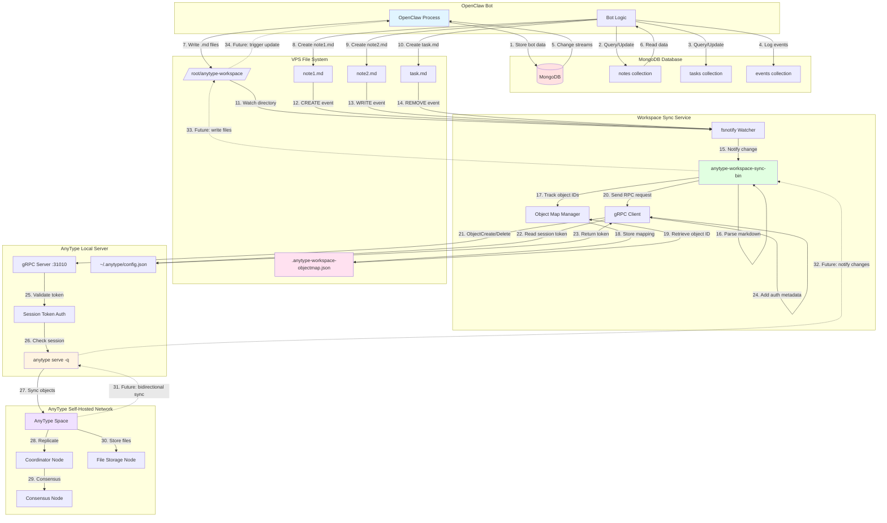
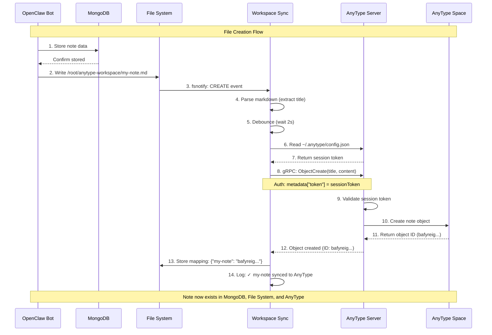
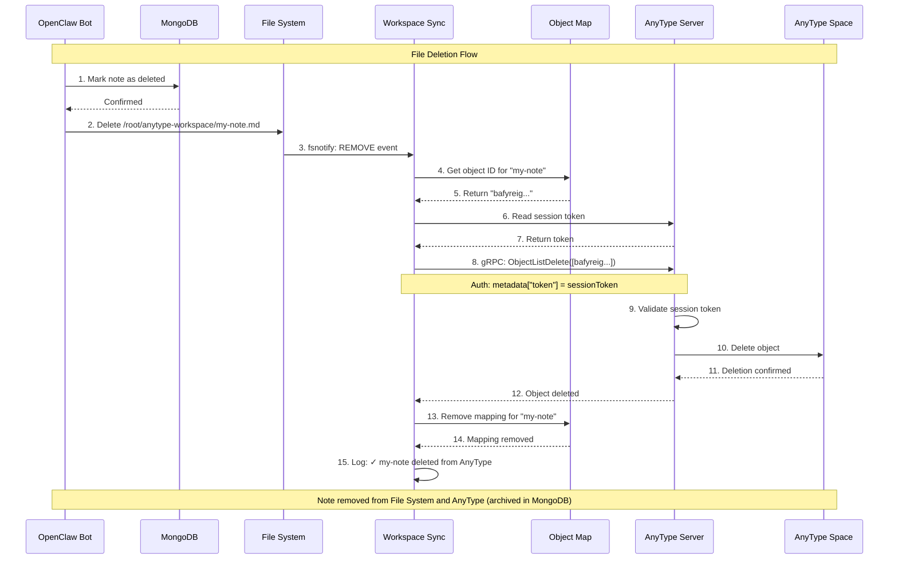
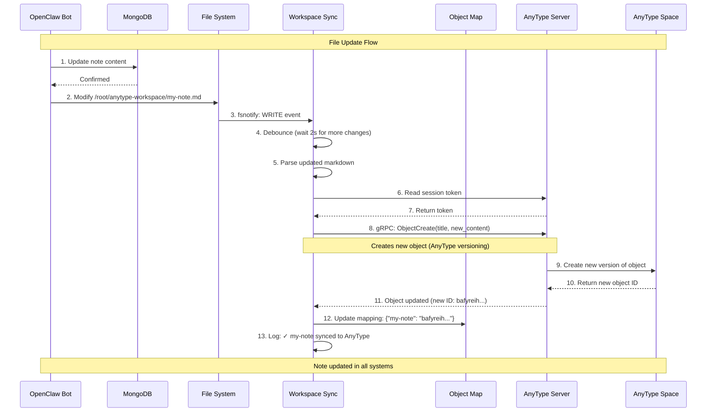
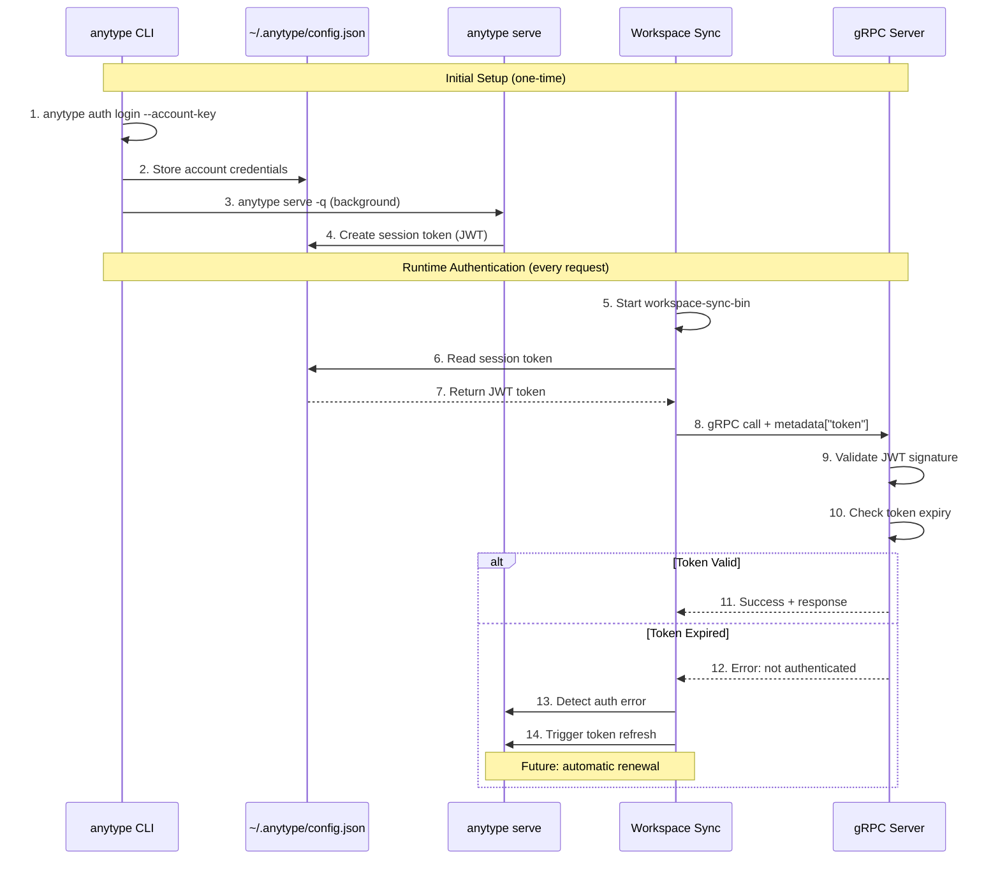

# OpenClaw + MongoDB + AnyType System Flow

This document illustrates the complete data flow between OpenClaw, MongoDB, and AnyType workspace sync.

## System Architecture Diagram



## Sequence Diagram: Create Flow



## Sequence Diagram: Delete Flow



## Sequence Diagram: Update Flow



## Authentication Flow



## Data Flow Summary

### 1. OpenClaw → MongoDB (Primary Data Store)
- OpenClaw stores all bot state, notes, tasks in MongoDB
- Uses MongoDB change streams for real-time updates
- MongoDB is source of truth for bot logic

### 2. OpenClaw → File System (Export)
- OpenClaw writes markdown files to `/root/anytype-workspace/`
- Each note in MongoDB can generate a corresponding .md file
- File names are slug-ified note titles

### 3. File System → Workspace Sync (Watch)
- `fsnotify` watches directory for changes (CREATE, WRITE, REMOVE)
- 2-second debounce prevents duplicate syncs
- Tracks file modification timestamps

### 4. Workspace Sync → Object Map (Tracking)
- Maps filenames to AnyType object IDs
- Stored in `/root/.anytype-workspace-objectmap.json`
- Required for delete operations
- Thread-safe with mutex locks

### 5. Workspace Sync → AnyType Server (gRPC)
- Connects to `127.0.0.1:31010`
- Uses session token from `~/.anytype/config.json`
- RPC methods: `ObjectCreate`, `ObjectListDelete`, `WorkspaceOpen`

### 6. AnyType Server → Space (Sync)
- `anytype serve` maintains connection to self-hosted network
- Syncs objects to coordinator, consensus, and file nodes
- Handles network-level replication

## File Locations

| Component | Location | Purpose |
|-----------|----------|---------|
| OpenClaw Bot | `/path/to/openclaw/` | Bot application |
| MongoDB | `mongodb://localhost:27017` | Primary database |
| Workspace Dir | `/root/anytype-workspace/` | Markdown files |
| Sync Service | `/root/anytype-workspace-sync-bin` | File watcher |
| Object Map | `/root/.anytype-workspace-objectmap.json` | ID mappings |
| AnyType Config | `/root/.anytype/config.json` | Session token |
| AnyType Server | `/root/.local/bin/anytype` | CLI + server |
| Network Config | `/var/lib/anytype/data/client-config.yml` | Network nodes |

## Network Topology

```mermaid
graph LR
    subgraph "VPS Server"
        OC[OpenClaw]
        DB[(MongoDB)]
        WS[Workspace Sync]
        AT[AnyType Server]
    end

    subgraph "Self-Hosted AnyType Network"
        C[Coordinator Node]
        CN[Consensus Node]
        F[File Node]
    end

    subgraph "AnyType Clients"
        Desktop[AnyType Desktop App]
        Mobile[AnyType Mobile App]
    end

    OC <-->|Read/Write| DB
    OC -->|Write .md| WS
    WS -->|gRPC :31010| AT
    AT <-->|Network Sync| C
    C <-->|Consensus| CN
    C <-->|Store Files| F
    Desktop <-->|Sync| C
    Mobile <-->|Sync| C

    style VPS fill:#e1f5ff
    style "Self-Hosted AnyType Network" fill:#f0e1ff
    style "AnyType Clients" fill:#ffe1e1
```

## Performance Characteristics

- **File Change Detection**: < 1 second (fsnotify)
- **Debounce Time**: 2 seconds (prevents duplicate syncs)
- **gRPC Object Creation**: 100-300ms
- **Total Sync Latency**: ~2-5 seconds (file write → AnyType object)
- **MongoDB Query**: 10-50ms (local network)
- **Network Sync**: Varies (depends on network topology)

## Future Enhancements

1. **Bidirectional Sync** (dotted lines in diagram)
   - AnyType changes → File System
   - File System → MongoDB
   - MongoDB → OpenClaw notification

2. **Automatic Token Refresh**
   - Detect auth failures
   - Restart AnyType server
   - Reload token automatically

3. **Conflict Resolution**
   - Handle simultaneous edits
   - Last-write-wins vs merge strategies

4. **Webhook Notifications**
   - OpenClaw receives sync completion events
   - Real-time status updates

---

**Legend:**
- Solid lines (—): Current implementation
- Dotted lines (- -): Future/planned features
- Numbers: Sequential operation order
